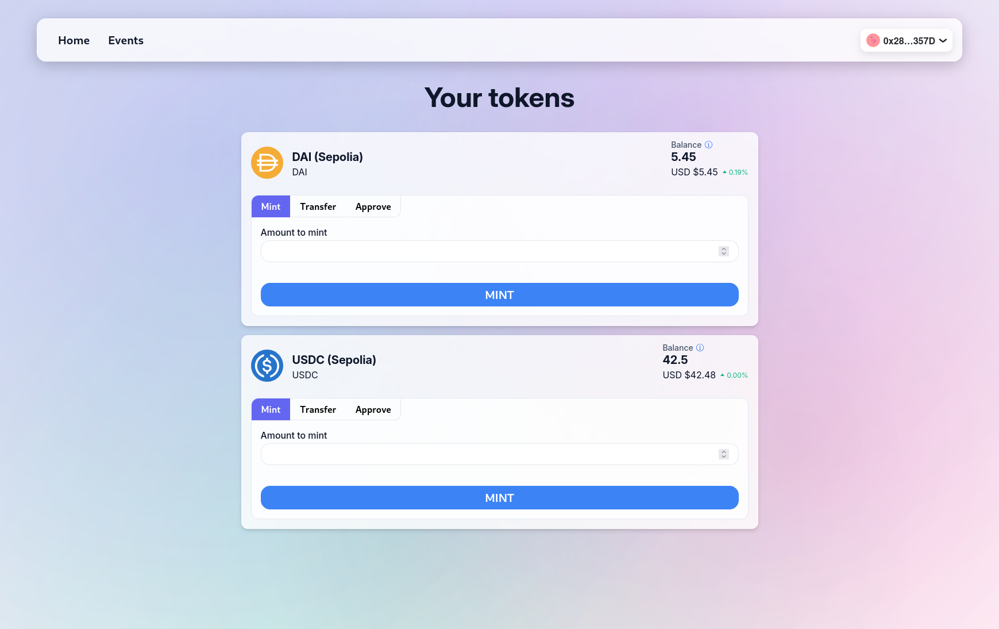
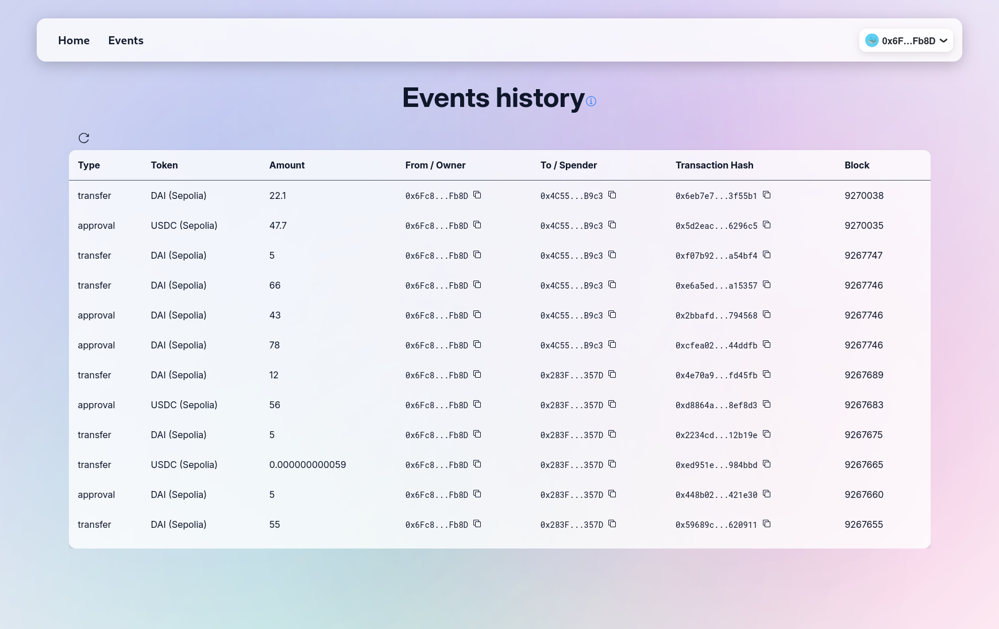

# Wonderland Challenge

A React dapp built for a [technical challenge](FRONTEND_CHALLENGE.md).  
It runs on the Sepolia testnet and lets you see balances, mint, approve, and transfer **DAI** and **USDC** tokens through a clean, modern interface

[](https://mini-dapp-chi.vercel.app)


<p align="center" >
  
  
</p>

## Table of Contents

- [Usage](#usage)
- [Features](#features)
- [Tech Stack, Libraries & Tools](#tech-stack-libraries--tools)
- [Technical tour](#technical-tour)
- [Installation](#installation)

## Usage

To use this dapp, you need an Ethereum wallet such as [Rainbow](https://rainbow.me/en/) or [MetaMask](https://metamask.io/).

To perform any actions, you also need some Sepolia ETH to pay for gas fees. You can request free Sepolia ETH from the [Alchemy faucet](https://www.alchemy.com/faucets/ethereum-sepolia).

After that, connect your wallet to the dapp and start using it.

## Features

### Blockchain & Wallet

- **Wallet Connection:** Connect seamlessly using RainbowKit with multi-wallet support
- **Network Management:** Automatic wrong chain detection with Sepolia switching
- **Balance Overview:** DAI/USDC balances with USD values fetched from CoinGecko API (mainnet-priced).

### Token Operations

- **Mint, Transfer & Approve:** Actions with validation and user feedback
- **Event History Table:** Track all relevant Approval and Transfer events from the last ~10,000 blocks

### User Experience

- **Responsive Design:** Flawless experience across all devices
- **Accessible Components:** Radix-UI based, WCAG-compliant interface
- **Custom Styling:** Unique CSS modules with smooth animations
- **Routing:** React-router-dom with 404 handling

### Code Quality & Architecture

- **Full Type Safety:** Comprehensive TypeScript implementation
- **Global State Management:** Zustand store with structured architecture
- **Schema Validation:** Zod + react-hook-form for advanced forms validation
- **Testing:** Unit tests for critical paths
- **Code Standards:** Prettier, ESLint, Husky, and lint-staged

## Tech Stack, Libraries & Tools

### Core

- **React** - UI library
- **Vite** - Build tool and development server
- **TypeScript** - Type-safe JavaScript

### Routing & State Management

- **React Router** - Client-side routing
- **Zustand** - Global state management

### Blockchain Integration

- **RainbowKit** - Wallet connection framework
- **Wagmi** - React hooks for Ethereum
- **Viem** - Low-level Ethereum interface
- **TanStack Query** - Data fetching and caching

### UI & Styling

- **Radix-UI** - Accessible component primitives
- **CSS Modules** - Scoped CSS styling
- **React Loading Skeleton** - Loading state components

### Forms & Validation

- **React Hook Form** - Form state management
- **Zod** - Schema validation

### Testing

- **Vitest** - Test runner
- **React Testing Library** - Component testing utilities

### Code Quality & DX

- **ESLint** - Code linting
- **Prettier** - Code formatting
- **Husky** - Git hooks
- **Lint Staged** - Run linter and formatter on staged files

## Technical tour

This project was built as a **DeFi front-end technical challenge** provided by the [wonderland team](https://wonderland.xyz/squad). You can see the [instructions](FRONTEND_CHALLENGE.md).
It is a React dapp that allows users to connect their wallet and interact with the blockchain on the Sepolia testnet.

For most blockchain interactions, such as reading and writing to contracts, I used Wagmi hooks. For the events logs, instead, I used Viem. I implemented custom hooks which abstract the interaction with both libraries, making it easy to consume them across the application, maintain and scale if needed.

### On-chain Data & Store

A store built on top of zustand is the single source of truth for blockchain data (token balances, events, etc.), loading states and callbacks for refetching.

The store is designed following the [Bridge Pattern](https://refactoring.guru/design-patterns/bridge), which consists in separating the store structure into two hierarchies: the abstraction (or interface) and the implementation (or platform). This separates the concerns, abstracting the consumers of the store from the implementation details, and making it ridiculously easy to extend functionalities and maintain.

The **abstraction layer** is formed by the [`useTokensStore`](src/stores/tokens/useTokensStore.ts) hook, which assembles the pieces from the implementation layer. It returns declarative, ready-to-use data and methods, such as `tokenBalances` and `refreshBalances()`. `useTokensStore` is the only source of truth for blockchain data, and the single point of contact that external components have with the store.

The **implementation layer** is formed by the hooks:

- [`useInternalTokensStore`](src/stores/tokens/useInternalTokensStore.ts). It is the actual zustand implementation which holds all the getters and setters, which are used by `useTokensStore` to update and retrieve data.

- [`useTokensData`](src/hooks/useTokensData.ts). It fetches balances and decimals using wagmi hooks. They are fetched with `useReadContracts` for the supported tokens (held by a constant defined in [config/tokens.ts](src/config/tokens.ts)).

  > Note: This could be optimized by fetching balances and decimals separately, using `useReadContract` for each one individually.

- [`useTokensEvents`](src/hooks/useTokensEvents.ts). It fetches the transfer and approval events logs of the last ~10,000 blocks on-demand (via `getEvents`) using viem's `getLogs` method and parsing the received data into [`TokenEvent`](src/models/tokens.ts) interface. Only the events in which the user's address is the owner or sender are included.

  > Note: `TokenEvent` could be inferred from a zod schema to parse the fetched data using zod's `safeParse` instead of mapping properties of a typed object. I chose not to implement it here for consistency with the rest of the fetching logic that doesn't use zod such as [`fetchTokenMarketData`](src/api/fetchTokenMarketData.ts) (or maybe I was too lazy to do it).

This design keeps the code clean, maintainable and scalable, as each piece of code is loosely coupled with the others, each one has its own responsibility, and the interface layer remains open for extension and closed for modification.

### User actions & writing to blockchain

When the wallet is connected, the user is able to make mint, transfer and approve transactions using the DAI and USDC Sepolia smart contracts. Those transactions are executed through the components:

- [`MintForm`](src/components/TokenCard/components/ActionsBox/components/MintForm/MintForm.tsx)
- [`TransferForm`](src/components/TokenCard/components/ActionsBox/components/TransferForm/TransferForm.tsx)
- [`ApproveForm`](src/components/TokenCard/components/ActionsBox/components/ApproveForm/ApproveForm.tsx)

Those 3 components declare their corresponding zod schema with which the form will be validated, and pass it to the general [`ActionForm`](src/components/TokenCard/components/ActionsBox/components/ActionForm/ActionForm.tsx) component, which has the core form logic for executing an action: it handles the submit and sends feedback to the users via [`useUserMessages`](src/hooks/useUserMessages.ts).

> Note: The ActionForm relies on reusable controlled form components in [src/components/forms](src/components/forms/)

The three listed components, to perform the corresponding actions, rely on the hooks:

- [`useMintToken`](src/hooks/tokensActions/useMintToken.ts)
- [`useTransferToken`](src/hooks/tokensActions/useTransferToken.ts)
- [`useApproveToken`](src/hooks/tokensActions/useApproveToken.ts)

These hooks, expose `mint()`, `transfer()` and `approve()` functions respectively, with their loading states an errors. They use `writeContractAsync()` from `useWriteContract` wagmi's hook for executing the transactions, and send error feedback directly to the user via [`useUserMessages`](src/hooks/useUserMessages.ts).

When the user clicks the submit button, it shows a loading state in two phases: e.g. "Minting..." and "Waiting transaction...". And to avoid confusion or unexpected behaviors, when it is loading, the navigation buttons are disabled while `isFormActionPending` is true, consumed from [`useTokensStore`](src/stores/tokens/useTokensStore.ts).

If the transaction succeeds, the user’s balance is refreshed via `refreshBalances()`. Success feedback is shown via `useUserMessages`, and the buttons are re-enabled.

## Installation

To run this project locally, follow these steps:

1. **Clone the repository**

```bash
git clone https://github.com/fran-dv/mini-dapp.git
```

2. **Install dependencies with Bun**

This project uses Bun as the package manager and Bunx as the package runner, so you should install dependencies using:

```bash
bun install
```

3. **Set up environment variables**

Create a .env.local file in the root directory with the following variables:

```bash
VITE_WALLETCONNECT_PROJECT_ID=your_walletconnect_project_id
VITE_COINGECKO_API_KEY=your_coingecko_api_key
```

Get your WalletConnect project ID at [WalletConnect site](https://cloud.walletconnect.com/)
Get your CoinGecko API key at [CoinGecko API site](https://www.coingecko.com/en/api)

4. **Start the development server**

```bash
bun dev
```

Then open http://localhost:5173 in your browser.

---

Made with ❤️ and a lot of enthusiasm by [fran-dv](https://github.com/fran-dv)
